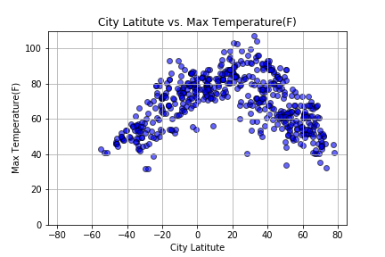

# Weather By Latitude
Visualization global weather patterns by latitude

## Summary
Deployed Summary: [Weather By Latitude](https://faznaimov.github.io/Weather-Py/ "Weather By Latitude")

An analysis of weather patterns using python, the OpenWeatherMap API, and citypy to visualize trends in temperature, humidity, cloudiness, and windyness by latitude

## Analysis
- Average temperature generally increases the closer a location is to the equator
- The variance of temperature ranges appears to increase the further a location is from the equator. Average temperatures for locations within ~5 degrees of the equator only vary by about 20 degrees Fahrenheit, while temperatures around 70 degress latitude vary from about -30 degrees to 35 degress Fahrenheit.
- Their are not strongly discernable trends between latitude and humidity, cloudiness, and windiness. However there may be a loose correlation between increased humidity at higher latitudes and increased windiness further from the equator.

Note: For this analysis I used the OpenWeatherMap APIs 5 day forecast to ensure that temperatures and other data points were averaged out for all times of day. Ideally historical data would be used, but that data is only available at a cost. Using the historical weather data may be a future improvement.

## Generate List of Cities

```python
# Lists holding coordinates and cities
coordinates = []
cities = []

# Create a set of random lat and lon combinations
lat = np.random.uniform(low=-90.000, high=90.000, size=1500)
lon = np.random.uniform(low=-180.000, high=180.000, size=1500)
coordinates = zip(lat, lon)

# Identify nearest city for each lat, lon combination
for coordinate_pair in coordinates:
    lat, lon = coordinate_pair
    
    city = citipy.nearest_city(lat, lon).city_name
    
    # Replace spaces with %20 to create url correctly 
    city = city.replace(" ", "%20")
    
    # If the city is unique, then add it to a our cities list
    if city not in cities:

        cities.append(city)

# Print the city count to confirm sufficient count
len(cities)
```

## Perform API Calls to OpenWeatherMap


```python
# Create empty lists to append the API data into lists 
city_name = []
cloudiness = []
country = []
date = []
humidity = []
lat = []
lng = []
max_temp = []
wind_speed = []

# Starting URL for Weather Map API Call
url = "http://api.openweathermap.org/data/2.5/weather?units=Imperial&APPID=" + api_key

# Will keep the count of records
record = 1

# Log file print statement
print("Beginning Data Retrieval")
print("-------------------------------")

# Loop through the cities in the city list
for city in cities:


    try:
        # API request
        response = requests.get(f"{url}&q={city}").json()
        
        # Append the data to lists
        city_name.append(response["name"])
        cloudiness.append(response["clouds"]["all"])
        country.append(response["sys"]["country"])
        date.append(response["dt"])
        humidity.append(response["main"]["humidity"])
        max_temp.append(response["main"]["temp_max"])
        lat.append(response["coord"]["lat"])
        lng.append(response["coord"]["lon"])
        wind_speed.append(response["wind"]["speed"])
        
        city_record = response["name"]

        print(f"Processing Record {record} | {city_record}")
        print(f"{url}&q={city}")

        # Increase counter by one
        record= record + 1

        # Wait a second in loop to not over exceed rate limit of API
        time.sleep(1.01)

    except:
        print("City not found. Skipping...")

print("Data Retrieval Complete")
```
## Add results into DataFrame
```python
# Creating a dataframe
df = pd.DataFrame({
    "City": city_name,
    "Cloudiness":cloudiness, 
    "Country":country,
    "Date":date, 
    "Humidity": humidity,
    "Lat":lat, 
    "Lng":lng, 
    "Max Temp": max_temp,
    "Wind Speed":wind_speed
})
```

## Plot Temperature vs. Latitude


```python
# Gettting lists of city latitudes and max temperature
city_lat = df["Lat"]
max_temp = df["Max Temp"]

# Creating scatter plot
plt.scatter(city_lat, max_temp, marker="o", facecolor="red",edgecolors="black")

# Assigning title, lables and setting x and y limits (Making plot look pretty)
plt.title("City Latitute vs. Max Temperature(F)")
plt.xlabel("City Latitute")
plt.ylabel("Max Temperature(F)")
plt.grid()
plt.xlim(-85,85)
plt.ylim(0,110)
plt.show()
```





## Plot Humidity vs. Latitude


```python
# Gettting lists of city latitudes and humidity
lat = df["Lat"]
hum = df["Humidity"]

# Build the scatter plots for each city types
plt.scatter(lat, hum, marker="o", facecolors="red", edgecolors="black")

# Incorporate the other graph properties
plt.grid()
plt.xlim(-90,90)
plt.ylim(0,110)
plt.title("City Latitude vs. Humidity")
plt.xlabel("City Latitude")
plt.ylabel("Humidity")
plt.show()
```


## Plot Cloudiness vs. Latitude

```python
# Gettting lists of city latitudes and cloudiness
lat = df["Lat"]
cloud = df["Cloudiness"]

# Build the scatter plots for each city types
plt.scatter(lat, cloud, marker="o", facecolors="red", edgecolors="black")

# Incorporate the other graph properties
plt.grid()
plt.xlim(-90,90)
plt.ylim(-10,110)
plt.title("City Latitude vs. Cloudiness")
plt.xlabel("City Latitude")
plt.ylabel("Cloudiness")
plt.show()
```


## Plot Windiness vs. Latitude

```python
# Gettting lists of city latitudes Wind Speed
lat = df["Lat"]
wind = df["Wind Speed"]

# Build the scatter plots for each city types
plt.scatter(lat, wind, marker="o", facecolors="red", edgecolors="black")

# Incorporate the other graph properties
plt.grid()
plt.xlim(-90,90)
plt.ylim(-5,50)
plt.title("City Latitude vs. Wind Speed")
plt.xlabel("City Latitude")
plt.ylabel("Wind Speed")
plt.show()
```


